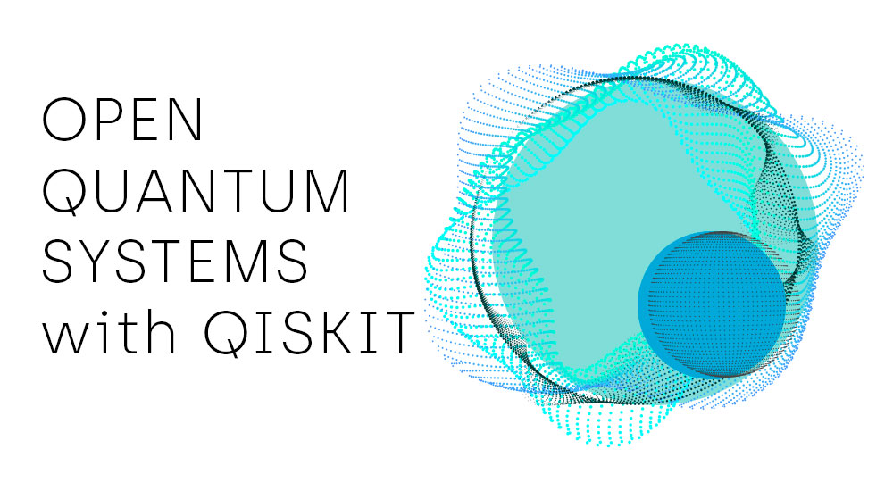
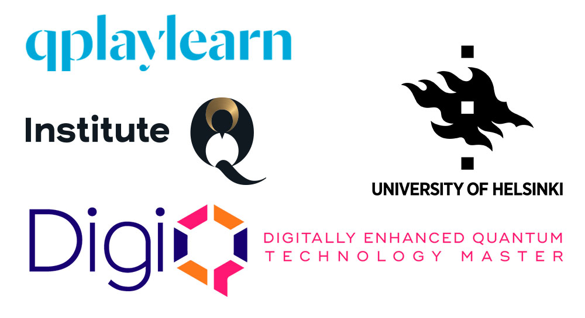

Tämä projektisarja perustuu kurssiin **Open Quantum Systems (OQS) with Qiskit**, joka esittlee avointen kvanttisysteemien perusteet ja tärkeimmät käsitteet. Alkuperäinen kurssi tarjosi uudenlaisen lähestymistavan avoimiin kvanttisysteemeihin: opiskelijat pääsivät simuloimaan monia tyypillisiä esimerkkejä niiden dynamiikaasta [Qiskitillä] (https://qiskit.org) ja [IBM Quantum Platformilla](https://quantum-computing.ibm.com). Kurssin idea on peräisin julkaisusta ([García-Pérez, Rossi, Maniscalco, NPJ Quantum Inform. 6, 1 (2020)](https://www.nature.com/articles/s41534-019-0235-y)), jossa kirjoittajat näyttävät, että IBM Quantum Platform on monipuolinen ja luotettava/vahva alusta avoimien kvanttisysteemien simuloimiseen. 

Projektit on suunnattu maisteriopiskelijoille, joilla on taustaa kvanttimekaniikasta ja kvantti-informaatioteoriasta, ja jotka haluavat oppia käyttämään Qiskitiä. Projektit on tarkoitettu luentojen tueksi ja ideaalisessa tilanteessa niitä käydään läpi *ohjatuissa käytännön harjoituksissa* joissa opiskelijat saavat tehdä kvanttipiirejä ja analysoida niiden tuloksia. 

# Sisällysluettelo

1. [Aloitus](getting_started.html)

## Projektit

1. [Depolarisoiva kanava](project_1-depolarizing_channel.html) ([Ratkaisu](project_1-solution.html))
2. [Paulin kanava](project_2-pauli_channel.html) ([Ratkaisu](project_2-solution.html))
3. [Markovin varasto -tekniikka](project_3-reservoir-engineering.html) ([Ratkaisu](project_3-solution.html))
4. [Amplitudin vaimennus](project_4-amplitude_damping.html) ([Ratkaisu](project_4-solution.html))
5. [Lopputyö](final_project.html) ([Ratkaisu](final_project-solutions.html))

